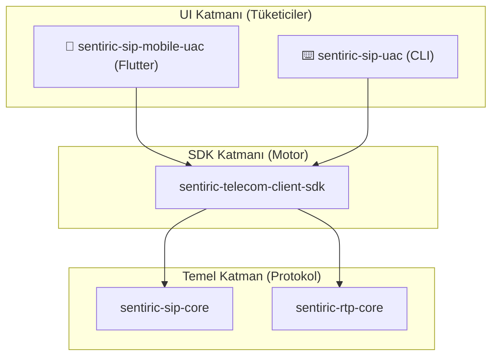

# 📲 Sentiric Telecom Client SDK

[]()
[]()
[]()

**Sentiric Telecom Client SDK**, mobil, masaüstü ve CLI istemcilerinin Sentiric platformuyla SIP/RTP üzerinden sesli iletişim kurmasını sağlayan, Rust tabanlı, yüksek performanslı bir motordur.

Bu kütüphane, bir "Softphone'un Beyni" olarak tasarlanmıştır. Düşük seviyeli protokol karmaşıklığını yönetir ve UI katmanına basit, olay tabanlı bir arayüz sunar.

## 🎯 Temel Sorumluluklar

1.  **SIP State Machine:** Çağrı yaşam döngüsünü (`Dialing`, `Ringing`, `Connected`, `Terminated`) yönetir. `200 OK` alındığında otomatik `ACK` göndererek 3-yönlü el sıkışmayı garantiler.
2.  **RTP Medya Motoru:** `rtp-core` kütüphanesini kullanarak, cihazın mikrofonundan gelen sesi RTP paketlerine dönüştürür ve gelen RTP paketlerini çözerek hoparlöre yönlendirir.
3.  **NAT Traversal Zekası:** Sunucudan gelen SDP yanıtını (`200 OK`) analiz ederek, medyanın gönderileceği doğru IP adresi ve portu (RTP Latching) dinamik olarak tespit eder.
4.  **Donanım Soyutlaması:** `cpal` kütüphanesi aracılığıyla platformdan bağımsız (cross-platform) bir şekilde mikrofon ve hoparlör erişimi sağlar.
5.  **Olay Tabanlı Arayüz:** `CallStateChanged`, `Error` gibi olayları, UI katmanının (Flutter, CLI) dinleyebileceği bir stream üzerinden yayınlar.

## 🏛️ Mimari Konum

Bu SDK, `sentiric-sip-core` ve `sentiric-rtp-core` temel kütüphanelerinin üzerine inşa edilmiştir. UI katmanları (`sentiric-sip-mobile-uac`, `sentiric-sip-uac`) için tüm telekom mantığını soyutlayan bir **"Motor Katmanı"** görevi görür.



## 📦 Entegrasyon

Bu kütüphane, `Cargo.toml` dosyasına eklenerek kullanılır.

```toml
[dependencies]
sentiric-telecom-client-sdk = { git = "https://github.com/sentiric/sentiric-telecom-client-sdk.git", branch = "main" }
```

---
© 2026 Sentiric Team | GNU AGPL-3.0 License
